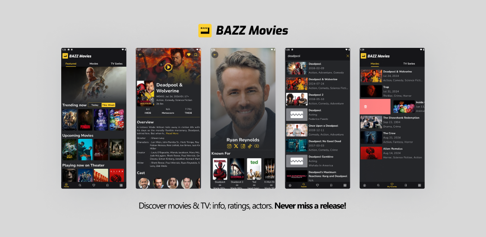

<p align="center">
    <picture>
      <source media="(prefers-color-scheme: dark)" srcset="docs/images/bazz-movies-light.svg">
      <source media="(prefers-color-scheme: light)" srcset="docs/images/bazz-movies.svg">
      
    </picture>
</p>

<h3 align="center">
 Movies Catalog Android App
</h3>

<p align="center">
 <strong>
  <a href="https://waffiqaziz.github.io/bazzmovies">Website</a>
  •
  <a href="https://play.google.com/store/apps/details?id=com.bazz.bazz_movies">Play Store</a>
  •
  <a href="https://docs.google.com/document/d/1HNrj5i3Rnpr50Ldwgfz5ODpaJoWF17TXIop7xwtXkiU/edit?usp=sharing">FAQ</a>
 </strong>
</p>
<p align="center">
 <a href="https://github.com/waffiqaziz/BAZZ-Movies/releases"></a>
  <a href="https://github.com/waffiqaziz/BAZZ-Movies/releases"></a>
 <a href="https://github.com/waffiqaziz/BAZZ-Movies/pulse"></a>
 <a href="https://github.com/waffiqaziz/BAZZ-Movies/actions"></a>
 <a href="https://github.com/waffiqaziz/BAZZ-Movies/actions/workflows/android_test.yml">
 </a>
 <a href="https://github.com/waffiqaziz/BAZZ-Movies/actions/workflows/codeql.yml"></a>
 <a href="https://codecov.io/gh/waffiqaziz/BAZZ-Movies" >
 </a>
 <a href="https://sonarcloud.io/summary/new_code?id=waffiqaziz_BAZZ-Movies"></a>
 <a href="https://www.apache.org/licenses/LICENSE-2.0"></a>
 <a href="https://github.com/waffiqaziz/BAZZ-Movies/issues"></a>
 <a href=""></a>
</p>

<p align="center">
 
</p>

## 🚀 About

BAZZ Movies is an Android app build with Kotlin, offering comprehensive movie and TV catalog. BAZZ
Movies allows users to discover, explore, and manage their favorite and watchlist with ease.

This project is a non-commercial application for showcasing movies and TV shows, intended for
personal and educational use as part of my portfolio.

_BAZZ Movies use TMDB API, but not endorsed, certified, or approved by TMDB_

## 🌟 Features

- Integrated with [TMDB](https://themoviedb.org/) account
- Save favorites and watchlist on local
- Swipe action for easy to organize between favorite and watchlist
- Guest session (no need to login)
- Search movies, tv-series, and actors
- Detailed information

## ⬇️ Download

BAZZ Movies available downloaded via Google Play Store

<a href="https://play.google.com/store/apps/details?id=com.bazz.bazz_movies" target="_blank">

</a>

## 📝 Installation

1. Make sure already install [Android Studio](https://developer.android.com/studio).
2. Clone this project.
3. (Optional)
   Configure [Crashlytics](https://firebase.google.com/docs/crashlytics/get-started?platform=android)
   and [Analytics](https://firebase.google.com/docs/analytics/get-started?platform=android)
4. Get your api on [TMDB](https://developer.themoviedb.org/docs/getting-started)
   and [OMDb](https://www.omdbapi.com/apikey.aspx).
5. Create or edit `local.properties` and put your API keys:

   ```properties
   TMDB_API_KEY = { TMDB_API_KEY }
   OMDB_API_KEY = { OMDB_API_KEY }
   ```

6. Build the project (`Ctrl + F9`).
7. Run with your virtual or phone devices

## 🧪 Testing

Please read this [page](/docs/BAZZMoviesTesting.md).

## 🛠️ Architecture

The **BAZZ Movies** app follows the
[official architecture guidance](https://developer.android.com/topic/architecture)
and is described in detail in the
[BAZZ Movies modularization](docs/BAZZMoviesModularization.md).

## 🤝 How to Contribute

Please read this [page](CONTRIBUTING.md).

## 📜 Licenses and Usage

This application is released under the [Apache Version 2.0 License](LICENSE).

    Copyright (C) 2024 Waffiq Aziz

    Licensed under the Apache License, Version 2.0 (the "License");
    you may not use this file except in compliance with the License.
    You may obtain a copy of the License at

       http://www.apache.org/licenses/LICENSE-2.0

    Unless required by applicable law or agreed to in writing, software
    distributed under the License is distributed on an "AS IS" BASIS,
    WITHOUT WARRANTIES OR CONDITIONS OF ANY KIND, either express or implied.
    See the License for the specific language governing permissions and
    limitations under the License.

### Note

- BAZZ Movies uses third-party API to function.
- Developers must secure their own API key and adhere to the API's terms of service.

### Third-Party Libraries

1. TMDB API: Provides movie and TV data.
   See [TMDB Terms](https://www.themoviedb.org/api-terms-of-use).
2. OMDb API: RESTful service for movie info. See [OMDb Terms](https://www.omdbapi.com/legal.htm).
3. GLide: Image loading library - [GitHub](https://github.com/bumptech/glide).
4. ExpandableTextView: An expandable Android
   TextView - [GitHub](https://github.com/glailton/ExpandableTextView).
5. Shimmer Android: Library shimmering
   effects - [GitHub](https://github.com/facebookarchive/shimmer-android)
6. Country Picker Android: (Apache
   2.0) - [GitHub](https://github.com/waffiqaziz/country-picker-android).
7. okhttp, retrofit, moshi: (Apache 2.0) - [GitHub](https://github.com/square).
8. country: IP-to-country geolocation API - [Github](https://github.com/hakanensari/country).

### Fonts

Licensed under [Open Font License](https://openfontlicense.org/):

- [Nunito Sans](https://fonts.google.com/specimen/Nunito+Sans)
- [Exo Font](https://fonts.google.com/specimen/Exo)
