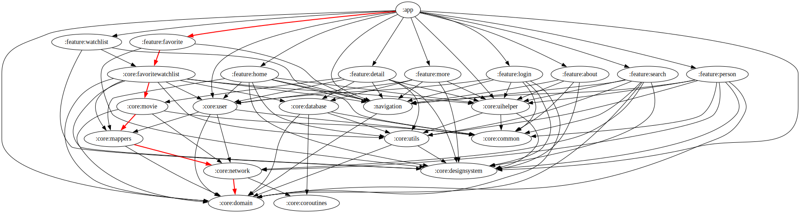

# :app Module

[![Code Coverage][app-coverage-badge]][app-coverage-link]

## Dependency Graph



## Overview

No additional setup is required, `:app` is the root module and is included automatically during build and app startup.

## Responsibilities

### Application Lifecycle

- **[MyApplication](../app/src/main/kotlin/com/waffiq/bazz_movies/MyApplication.kt)** – Initializes global configurations and sets up Hilt for dependency injection.
- **[MainActivity](../app/src/main/kotlin/com/waffiq/bazz_movies/MainActivity.kt)** – Hosts the app's UI and navigation, serving as the root container.
- **[RoutingActivity](../app/src/main/kotlin/com/waffiq/bazz_movies/RoutingActivity.kt)** – Intermediate entry point, typically used for redirecting users based on state(session).

### Dependency Injection

- **[NavigatorModule](../app/src/main/kotlin/com/waffiq/bazz_movies/di/NavigatorModule.kt)** – Provides the global `INavigator` implementation to manage navigation logic.
- **[SnackbarModule](../app/src/main/kotlin/com/waffiq/bazz_movies/di/SnackbarModule.kt)** – Provides an `AppSnackbarManager` to handle app-wide snackbars.

### Navigation

- **[AppNavigator](../app/src/main/kotlin/com/waffiq/bazz_movies/navigation/AppNavigator.kt)** – Central navigation handler that abstracts Intent creation and transition logic.

### Snackbar Management

- **[AppSnackbarManager](../app/src/main/kotlin/com/waffiq/bazz_movies/snackbar/AppSnackbarManager.kt)** – Centralized manager for showing snackbars across the application.

## Integration

This module is the application-level module and is automatically included during build. No additional integration steps are required for dependency inclusion.

## Example Usage

Using the global navigator in an adapter:

```kotlin
class MyAdapter(private val navigator: INavigator) :
  RecyclerView.Adapter<MyAdapter.ViewHolder>() {

  ...
  fun bind(data: MediaCastItem) {
    inner class ViewHolder(private var binding: MyViewBinding) :
      RecyclerView.ViewHolder(binding.root) {

      binding.picture.setOnClickListener {
        navigator.openPersonDetails(itemView.context, data)
      }
    }
  }
}

// simple way use
@Inject
lateinit var navigator: INavigator

fun function(data: MediaCastItem){
  navigator.openPersonDetails(context, data)
}
```

Showing a snackbar:

```kotlin
snackbarManager.showSnackbarWarning("Something is not working")
```

## Best Practices

- **Use `AppNavigator` to centralize all `Intent` creation and transitions**. This decouples activities from one another and improves testability.
- **Anchor snackbars to `bottom_navigation`** or other meaningful UI roots via `AppSnackbarManager`.
- **Keep `MainActivity` minimal** and delegate logic to fragments, ViewModels, or modules.
- **Use Hilt modules (`NavigatorModule`, `SnackbarModule`)** to inject app-wide utilities cleanly.

[app-coverage-badge]: https://codecov.io/gh/waffiqaziz/BAZZ-Movies/branch/main/graph/badge.svg?flag=app
[app-coverage-link]: https://app.codecov.io/gh/waffiqaziz/BAZZ-Movies/tree/main/app
