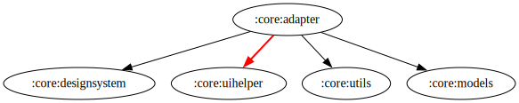

# :core:adapter Module

[![Code Coverage][core-adapter-coverage-badge]][core-adapter-coverage-link]

## Dependency Graph

## Overview

`:core:adapter` serves as a shared module for adapter-related binding logic. It centralizes
view-binding logic for adapter items, including data presentation, image loading, and UI state
binding, helping keep adapters clean and maintainable.

<!-- LINK -->

[core-adapter-coverage-badge]: https://codecov.io/gh/waffiqaziz/BAZZ-Movies/branch/main/graph/badge.svg?flag=core-adapter

[core-adapter-coverage-link]: https://app.codecov.io/gh/waffiqaziz/BAZZ-Movies/tree/main/core/adapter/src/main/kotlin/com/waffiq/bazz_movies/core/adapter
