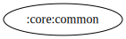

# :core:common Module  

[![Code Coverage][core-common-coverage-badge]][core-common-coverage-link]

## Dependency Graph  

  

## Overview  

`:core:common` is a utility module that provides shared constants and helper classes. It ensures consistency and avoids redundancy by centralizing commonly used values and event-handling mechanisms.  

## Responsibilities  

- **[Constants](../common/src/main/kotlin/com/waffiq/bazz_movies/core/common/utils/Constants.kt)**  
  - Defines reusable string constants, URLs, and numerical values used throughout the app.  
  - Includes API endpoint links, debounce durations, and various identifier strings.  

- **[Event Wrapper](../common/src/main/kotlin/com/waffiq/bazz_movies/core/common/utils/Event.kt)**  
  - Implements a wrapper class to handle one-time events in LiveData and ViewModels.  
  - Prevents multiple consumption of UI-triggered actions like navigation or messages.  

## Integration  

To use the module, add it as a dependency in `build.gradle` file:  

```gradle
dependencies {
    implementation(project(":core:common"))
}
```  

## Example Usage  

Using `Constants` to get predefined URLs or values:  

```kotlin
val imageUrl = Constants.TMDB_IMG_LINK_POSTER_W500 + movie.posterPath
```  

Handling one-time UI events with `Event`:  

```kotlin
private val _navigateToDetails = MutableLiveData<Event<String>>()
val navigateToDetails: LiveData<Event<String>> = _navigateToDetails

fun onMovieClicked(movieId: String) {
    _navigateToDetails.value = Event(movieId)
}
```

Observing the event in an Activity or Fragment:  

```kotlin
viewModel.navigateToDetails.observe(viewLifecycleOwner) { event ->
    event.getContentIfNotHandled()?.let { movieId ->
        navigateToMovieDetails(movieId)
    }
}
```

## Best Practices  

- **Use `Constants` for static values** – Prevents hardcoding strings and numbers throughout the codebase.  
- **Leverage `Event` for LiveData-based UI events** – Avoids unintended multiple event triggers.  
- **Keep this module lightweight** – It should only contain essential shared values and classes without business logic.  

This module provides a structured way to manage shared resources efficiently, improving maintainability and consistency across the application.

<!-- LINK -->

[core-common-coverage-badge]: https://codecov.io/gh/waffiqaziz/BAZZ-Movies/branch/main/graph/badge.svg?flag=core-common
[core-common-coverage-link]: https://app.codecov.io/gh/waffiqaziz/BAZZ-Movies/tree/main/core/common/src/main/kotlin/com/waffiq/bazz_movies/core/common
