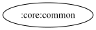

# :core:common Module

[![Code Coverage][core-common-coverage-badge]][core-common-coverage-link]

## Dependency Graph

## Overview

`:core:common` is a utility module that provides shared constants. It ensures consistency and avoids redundancy by centralizing commonly used values and event-handling mechanisms.

## Responsibilities

- **[Constants](../common/src/main/kotlin/com/waffiq/bazz_movies/core/common/utils/Constants.kt)**

  - Defines reusable string constants, URLs, and numerical values used throughout the app.
  - Includes API endpoint links, debounce durations, and various identifier strings.

<!-- LINK -->

[core-common-coverage-badge]: https://codecov.io/gh/waffiqaziz/BAZZ-Movies/branch/main/graph/badge.svg?flag=core-common
[core-common-coverage-link]: https://app.codecov.io/gh/waffiqaziz/BAZZ-Movies/tree/main/core/common/src/main/kotlin/com/waffiq/bazz_movies/core/common
