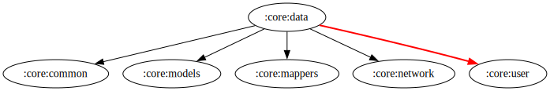

# :core:data Module

[![Code Coverage][core-data-coverage-badge]][core-data-coverage-link]

## Dependency Graph

## Overview

The `:core:data` module is responsible for managing shared data related to movies and TV series.

## Responsibilities

Handles fetching various types of media lists, including:

- Now Playing
- Airing This Week
- Popular
- Recommendations
- Trending
- Top Rated
- Upcoming

In addition, this module provides shared logic for user-specific interactions, such as:

- Adding or removing items from favorites
- Managing watchlists
- Retrieving media state (e.g., user rating, favorite status, watchlist status)

<!-- LINK -->

[core-data-coverage-badge]: https://codecov.io/gh/waffiqaziz/BAZZ-movie/branch/main/graph/badge.svg?flag=core-data

[core-data-coverage-link]: https://app.codecov.io/gh/waffiqaziz/BAZZ-movie/tree/main/core/data/src/main/kotlin/com/waffiq/bazz_movie/core/data
