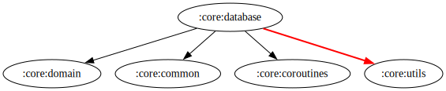

# :core:database Module  

[![Code Coverage][core-database-coverage-badge]][core-database-coverage-link]

## Dependency Graph  

  

## Overview  

`:core:database` is a module responsible for managing local data persistence using [Room Database](https://developer.android.com/jetpack/androidx/releases/room). It provides a structured and scalable approach to handling local storage while ensuring data integrity and efficient access.  

## Responsibilities  

- **[Local Data Source](../database/src/main/kotlin/com/waffiq/bazz_movies/core/database/data/datasource/LocalDataSource.kt)**  
  - Acts as an intermediary between the database and the repository layer.  
  - Implements [`LocalDataSourceInterface`](../database/src/main/kotlin/com/waffiq/bazz_movies/core/database/domain/usecase/localdatabase/LocalDatabaseUseCase.kt) to ensure abstraction and testability.  

- **[Room Database](../database/src/main/kotlin/com/waffiq/bazz_movies/core/database/data/room/FavoriteDatabase.kt)**  
  - Defines the database configuration and entities.  
  - Provides access to DAOs for data transactions.  

- **[Data Access Object (DAO)](../database/src/main/kotlin/com/waffiq/bazz_movies/core/database/data/room/FavoriteDao.kt)**  
  - Contains methods for querying, inserting, updating, and deleting data.  
  - Ensures efficient database interactions.  

- **[Entities](../database/src/main/kotlin/com/waffiq/bazz_movies/core/database/data/model/FavoriteEntity.kt)**  
  - Represents the database tables (entity).  

- **[Repository Implementation](../database/src/main/kotlin/com/waffiq/bazz_movies/core/database/data/repository/DatabaseRepositoryImpl.kt)**  
  - Provides an abstraction for accessing local storage through [`IDatabaseRepository`](./src/main/kotlin/com/waffiq/bazz_movies/core/database/domain/repository/IDatabaseRepository.kt).  
  
- **[Use Cases](../database/src/main/kotlin/com/waffiq/bazz_movies/core/database/domain/usecase/localdatabase/LocalDatabaseUseCase.kt)**  
  - Encapsulates business logic related to database operations.  

- **[Dependency Injection](../database/src/main/kotlin/com/waffiq/bazz_movies/core/database/di/)**  
  - Provides Hilt modules for injecting database dependencies.  

## Integration  

To use the module, add it as a dependency in `build.gradle` file:  

```gradle
dependencies {
    implementation(project(":core:database"))
}
```  

## Example Usage  

Inject the [`LocalDatabaseUseCase`](./src/main/kotlin/com/waffiq/bazz_movies/core/database/domain/usecase/localdatabase/LocalDatabaseUseCase.kt) in ViewModel and use it to interact with the database:  

```kotlin
class FavoriteViewModel @Inject constructor(
    private val localDatabaseUseCase: LocalDatabaseUseCase
) : ViewModel() {

    fun getFavorites(): LiveData<List<FavoriteEntity>> {
        return localDatabaseUseCase.getAllFavorites()
    }
}
```

## Best Practices  

- **Use DAOs for database interactions** – Avoid direct database queries in repositories.  
- **Abstract database access with a repository** – Keeps data logic modular and testable.  
- **Utilize dependency injection** – Ensures database components are properly managed.  
- **Encapsulate logic in use cases** – Maintains separation of concerns and clean architecture.  

This module establishes a robust local storage layer, ensuring data persistence and offline capabilities for the application.

<!-- LINK -->

[core-database-coverage-badge]: https://codecov.io/gh/waffiqaziz/BAZZ-Movies/branch/main/graph/badge.svg?flag=core-database
[core-database-coverage-link]: https://app.codecov.io/gh/waffiqaziz/BAZZ-Movies/tree/main/core/database/src/main/kotlin/com/waffiq/bazz_movies/core/database
