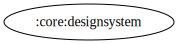

# \:core\:designsystem Module

[![Code Coverage][core-designsystem-coverage-badge]][core-designsystem-coverage-link]

  

## Overview

`:core:designsystem` is a module dedicated to managing the UI components and design resources used across the application. It provides a centralized place for reusable UI elements, styles, and animations, ensuring consistency and reducing redundancy in the project.

## Responsibilities

- **ViewPager Adapter**
  - [GenericViewPagerAdapter](../designsystem/src/main/kotlin/com/waffiq/bazz_movies/core/designsystem/viewpager/GenericViewPagerAdapter.kt): A generic `FragmentStateAdapter` implementation for managing a list of fragments inside a ViewPager.

- **UI Resources**
  - **Animations:** Contains reusable animations for UI transitions.
  - **Colors:** Defines the primary, secondary, and state-dependent colors for UI components.
  - **Drawables:** Includes background shapes, ripple effects, icons, and placeholders.
  - **Fonts:** Provides custom fonts for text styling.
  - **Layouts:** Contains XML files for various UI components like toolbar items, lists, and error illustrations.
  - **Themes:** Centralizes app themes and night mode configurations.

## Integration

To use the module, add it as a dependency in `build.gradle` file:

```gradle
dependencies {
    implementation(project(":core:designsystem"))
}
```

## Example Usage

Using `GenericViewPagerAdapter` in a `ViewPager2`:

```kotlin
val adapter = GenericViewPagerAdapter(supportFragmentManager, lifecycle, listOf(fragment1, fragment2))
viewPager.adapter = adapter
```

Applying a custom background drawable:

```xml
<ImageView
    android:layout_width="wrap_content"
    android:layout_height="wrap_content"
    android:background="@drawable/bg_button_group" />
```

## Best Practices

- **Encapsulate reusable UI components** – Avoid duplicating UI logic across modules.
- **Follow Material Design guidelines** – Ensure a consistent and accessible user experience.
- **Use theme attributes instead of hardcoded values** – Improves flexibility and adaptability to dark mode.

This module provides a structured approach to UI design, making the application more scalable and maintainable.

<!-- LINK -->

[core-designsystem-coverage-badge]: https://codecov.io/gh/waffiqaziz/BAZZ-Movies/branch/main/graph/badge.svg?flag=core-designsystem
[core-designsystem-coverage-link]: https://app.codecov.io/gh/waffiqaziz/BAZZ-Movies/tree/main/core/designsystem/src/main/kotlin/com/waffiq/bazz_movies/core/designsystem
