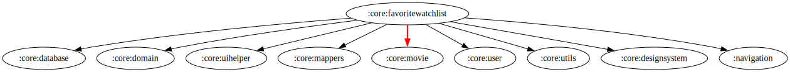

# :core:favoritewatchlist Module

## Dependency Graph  

  

## Overview

`:core:favoritewatchlist` is responsible for managing the favorite and watchlist functionality in the application. It provides UI adapters, view models, and utility classes to handle user interactions related to favoriting movies and TV shows.

## Responsibilities

### UI Components

- **[FavoriteAdapterDB](../favoritewatchlist/src/main/kotlin/com/waffiq/bazz_movies/core/favoritewatchlist/ui/adapter/FavoriteAdapterDB.kt)** – Handles displaying favorite items stored in the database.
- **[FavoriteMovieAdapter](../favoritewatchlist/src/main/kotlin/com/waffiq/bazz_movies/core/favoritewatchlist/ui/adapter/FavoriteMovieAdapter.kt)** – Adapter for displaying favorite movies.
- **[FavoriteTvAdapter](../favoritewatchlist/src/main/kotlin/com/waffiq/bazz_movies/core/favoritewatchlist/ui/adapter/FavoriteTvAdapter.kt)** – Adapter for displaying favorite TV shows.

### ViewModels

- **[BaseViewModel](../favoritewatchlist/src/main/kotlin/com/waffiq/bazz_movies/core/favoritewatchlist/ui/viewmodel/BaseViewModel.kt)** – A base class for shared ViewModel functionality.
- **[SharedDBViewModel](../favoritewatchlist/src/main/kotlin/com/waffiq/bazz_movies/core/favoritewatchlist/ui/viewmodel/SharedDBViewModel.kt)** – Manages interactions between the database and UI for favorite and watchlist items.

### Utility Classes

- **[Constants](../favoritewatchlist/src/main/kotlin/com/waffiq/bazz_movies/core/favoritewatchlist/utils/common/Constants.kt)** – Stores constant values used in the module.
- **[FavWatchlistHelper](../favoritewatchlist/src/main/kotlin/com/waffiq/bazz_movies/core/favoritewatchlist/utils/helpers/FavWatchlistHelper.kt)** – Provides utility methods for handling favorite and watchlist actions.
- **[SnackbarAlreadyUtils](../favoritewatchlist/src/main/kotlin/com/waffiq/bazz_movies/core/favoritewatchlist/utils/helpers/SnackbarAlreadyUtils.kt)** – Displays Snackbar messages related to item availability.
- **[SnackBarUserLoginData](../favoritewatchlist/src/main/kotlin/com/waffiq/bazz_movies/core/favoritewatchlist/utils/helpers/SnackBarUserLoginData.kt)** – Snackbar data that used to show the snackbar.
- **[SwipeCallbackHelper](../favoritewatchlist/src/main/kotlin/com/waffiq/bazz_movies/core/favoritewatchlist/utils/helpers/SwipeCallbackHelper.kt)** – Implements swipe actions for managing favorite/watchlist items.

## Integration

To use the module, add it as a dependency in `build.gradle` file:

```gradle
dependencies {
    implementation(project(":core:favoritewatchlist"))
}
```

## Example Usage

Observing Favorite Items in ViewModel:

```kotlin
viewModel.favoriteMovies.observe(viewLifecycleOwner) { movies ->
    adapter.submitList(movies)
}
```

Handling Swipe Actions:

```kotlin
val swipeCallback = object : SwipeCallbackHelper() {
    override fun onSwiped(viewHolder: RecyclerView.ViewHolder, direction: Int) {
        viewModel.removeFavorite(viewHolder.adapterPosition)
    }
}
```

## Best Practices

- **Use `SharedDBViewModel`** to maintain data consistency across UI components.
- **Leverage helper classes** to simplify favorite and watchlist operations.
- **Ensure proper UI feedback** by using Snackbar utilities for user interactions.

This module enhances the user experience by providing a structured way to manage favorite and watchlist items efficiently.
