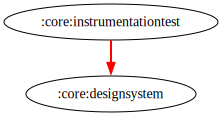

# :core:instrumentationtest Module

[![Code Coverage][core-instrumentationtest-coverage-badge]][core-instrumentationtest-coverage-link]

## Dependency Graph



## Overview

`:core:instrumentationtest` is a shared **instrumentation test** utility module used for testing
Hilt-enabled Fragments in isolation across multiple feature modules.
It provides utilities to simplify fragment testing with Hilt without requiring a dependency on the
`:app` module, avoiding potential circular dependencies.

## Responsibilities

- [`CustomTestRunner`](src/main/kotlin/com/waffiq/bazz_movies/core/instrumentationtest/CustomTestRunner.kt) –
  A custom AndroidJUnitRunner that overrides the default application with HiltTestApplication to
  support Hilt in instrumentation tests.
- [`HiltTestActivity`](src/main/kotlin/com/waffiq/bazz_movies/core/instrumentationtest/HiltTestActivity.kt) –
    A test-only `@AndroidEntryPoint` activity used as a container for testing fragments with Hilt
    support.
- [`launchFragmentInHiltContainer`](src/main/kotlin/com/waffiq/bazz_movies/core/instrumentationtest/HiltExt.kt) –
    A helper function to launch a fragment inside `HiltTestActivity` as a workaround for
    `launchFragmentInContainer`, which cannot be used when depending on the `:app` module.

## Integration

To use this module in other modules' `androidTest`, add the following dependency on
`build.gradle.kts`:

```gradle
android {
  defaultConfig {
    testInstrumentationRunner = "com.waffiq.bazz_movies.feature.search.testrunner.CustomTestRunner"
  }
}

dependencies {
  androidTestImplementation(project(":core:instrumentationtest"))
}
```

Then declare `HiltTestActivity` in `androidTest` manifest (`src/androidTest/AndroidManifest.xml`)
like so:

```xml

<manifest xmlns:android="http://schemas.android.com/apk/res/android">
  <application android:theme="@style/Base.Theme.BAZZ_movies">
    <activity android:name="com.waffiq.bazz_movies.core.instrumentationtest.HiltTestActivity"
      android:exported="true" android:windowSoftInputMode="stateHidden" android:autofillHints="" />
  </application>
</manifest>
```

## Example Usage

```kotlin
@Test
fun someFragmentTest() {
  launchFragmentInHiltContainer<MyFragment> {
    // perform assertions or interactions here
  }
}
```

or if you want also test the fragment component use

```kotlin
private lateinit var myFragment: MyFragment

@Before
fun setUp() {
  hiltRule.inject()

  myFragment = launchFragmentInHiltContainer<MyTestFragment>

  // others preparation
}

@Test
fun someFragmentTest() {
  onView(isRoot()).perform(waitFor(1000))
  myFragment.openPopup() // for example
  onView(isRoot()).perform(waitFor(500))

  // perform assertions or interactions here
}
```

## Reference

- [https://developer.android.com/training/dependency-injection/hilt-testing#launchfragment](https://developer.android.com/training/dependency-injection/hilt-testing#launchfragment)

<!-- LINK -->

[core-instrumentationtest-coverage-badge]: https://codecov.io/gh/waffiqaziz/BAZZ-Movies/branch/main/graph/badge.svg?flag=core-instrumentationtest

[core-instrumentationtest-coverage-link]: https://app.codecov.io/gh/waffiqaziz/BAZZ-Movies/tree/main/core/test/src/main/kotlin/com/waffiq/bazz_movies/core/instrumentationtest
