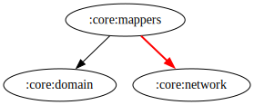

# :core:mappers Module

[![Code Coverage][core-mappers-coverage-badge]][core-mappers-coverage-link]

## Dependency Graph



## Overview

The `:core:mappers` module is responsible for converting data models between different layers of the application. It helps maintain separation of concerns by ensuring that domain models, data models, and UI models remain distinct and properly formatted.

## Responsibilities

- **[PostMapper](../mappers/src/main/kotlin/com/waffiq/bazz_movies/core/mappers/PostMapper.kt)**

  - Converts `Post` data objects into their domain representations.
  - Ensures proper transformation of API responses before usage.

- **[MediaItemMapper](../mappers/src/main/kotlin/com/waffiq/bazz_movies/core/mappers/MediaItemMapper.kt)**

  - Maps `MediaItem` objects between data and domain layers.
  - Handles cases where fields require formatting or type conversion.

- **[StateMapper](../mappers/src/main/kotlin/com/waffiq/bazz_movies/core/mappers/StateMapper.kt)**
  - Maps different states (e.g., loading, success, error) between repository and UI layers.
  - Standardizes state management across the app.

## Integration

To use the module, add it as a dependency in `build.gradle` file:

```gradle
dependencies {
    implementation(project(":core:mappers"))
}
```

## Example Usage

```kotlin
val postDomainModel = apiPostResponse.toPost()
```

## Best Practices

- **Keep mappers stateless** – They should be pure functions with no side effects.
- **Ensure proper error handling** – Handle nullability and type mismatches appropriately.
- **Follow a consistent mapping strategy** – Maintain clear naming conventions to improve readability.

This module plays a crucial role in ensuring data consistency and maintainability across the application.

<!-- LINK -->

[core-mappers-coverage-badge]: https://codecov.io/gh/waffiqaziz/BAZZ-Movies/branch/main/graph/badge.svg?flag=core-mappers
[core-mappers-coverage-link]: https://app.codecov.io/gh/waffiqaziz/BAZZ-Movies/tree/main/core/mappers/src/main/kotlin/com/waffiq/bazz_movies/core/mappers
