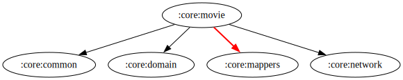

# :core:movie Module

[![Code Coverage][core-movie-coverage-badge]][core-movie-coverage-link]

## Dependency Graph



## Overview

`:core:movie` is responsible as shared managing movie-related data, including fetching movie details, handling repository logic, and implementing domain-specific use cases. This module follows clean architecture principles and integrates repository, use cases, and dependency injection to ensure modularity and testability.

## Responsibilities

### Data Layer

- **[MoviesRepository](../movie/src/main/kotlin/com/waffiq/bazz_movies/core/movie/data/repository/MoviesRepository.kt)**
  - Implements [`IMoviesRepository`](./src/main/kotlin/com/waffiq/bazz_movies/core/movie/domain/repository/IMoviesRepository.kt) to provide data from remote sources.
  - Fetches movie-related information and processes API responses.

### Domain Layer

- **Models**

  - **[PostFavoriteWatchlist](../movie/src/main/kotlin/com/waffiq/bazz_movies/core/movie/domain/model/post/PostFavoriteWatchlist.kt)** – Represents movie watchlist and favorite post data.

- **Repositories**

  - **[IMoviesRepository](../movie/src/main/kotlin/com/waffiq/bazz_movies/core/movie/domain/repository/IMoviesRepository.kt)** – Defines methods for retrieving movie data.

- **Use Cases**
  - **[Get Stated Movies](../movie/src/main/kotlin/com/waffiq/bazz_movies/core/movie/domain/usecase/getstated/GetStatedMovieUseCase.kt)** – Fetches trending or popular movies.
  - **[Get Stated TV Shows](../movie/src/main/kotlin/com/waffiq/bazz_movies/core/movie/domain/usecase/getstated/GetStatedTvUseCase.kt)** – Retrieves trending or top-rated TV shows.
  - **[Post Method Use Case](../movie/src/main/kotlin/com/waffiq/bazz_movies/core/movie/domain/usecase/postmethod/PostMethodUseCase.kt)** – Handles posting movie-related data (e.g., adding to watchlist).

### Dependency Injection

- **[MovieRepositoryModule](../movie/src/main/kotlin/com/waffiq/bazz_movies/core/movie/di/MovieRepositoryModule.kt)** – Provides [`MoviesRepository`](./src/main/kotlin/com/waffiq/bazz_movies/core/movie/data/repository/MoviesRepository.kt) as a dependency.

- **[PostMethodUseCaseModule](../movie/src/main/kotlin/com/waffiq/bazz_movies/core/movie/di/PostMethodUseCaseModule.kt)** – Supplies [`PostMethodUseCase`](../movie/src/main/kotlin/com/waffiq/bazz_movies/core/movie/domain/usecase/postmethod/PostMethodUseCase.kt) for use in ViewModels and repositories.

- **[StatedUseCaseModule](../movie/src/main/kotlin/com/waffiq/bazz_movies/core/movie/di/StatedUseCaseModule.kt)** – Provides [`GetStatedMovieUseCase`](../movie/src/main/kotlin/com/waffiq/bazz_movies/core/movie/domain/usecase/getstated/GetStatedMovieUseCase.kt) and [`GetStatedTvUseCase`](../movie/src/main/kotlin/com/waffiq/bazz_movies/core/movie/domain/usecase/getstated/GetStatedTvUseCase.kt).

### Utility Classes

- **[Mapper](../movie/src/main/kotlin/com/waffiq/bazz_movies/core/movie/utils/mappers/Mapper.kt)** – Converts API responses into domain models.

## Integration

To use the module, add it as a dependency in `build.gradle` file:

```gradle
dependencies {
    implementation(project(":core:movie"))
}
```

## Example Usage

Fetching movies in a ViewModel:

```kotlin
class MoviesViewModel @Inject constructor(
    private val getStatedMovieUseCase: GetStatedMovieUseCase
) : ViewModel() {

    val movies = liveData {
        emit(getStatedMovieUseCase.execute())
    }
}
```

Posting a movie to favorites:

```kotlin
viewModelScope.launch {
    postMethodUseCase.postFavorit(movieId)
}
```

## Best Practices

- **Follow clean architecture** – Keep data, domain, and UI layers separate.
- **Use dependency injection** – Ensure proper management of repository and use case instances.
- **Encapsulate business logic in use cases** – Maintain a structured and testable architecture.
- **Utilize mapper classes** – Convert raw API responses into clean domain models.

This module ensures efficient movie data handling, making it a core component of the application’s media management system.

<!-- LINK -->

[core-movie-coverage-badge]: https://codecov.io/gh/waffiqaziz/BAZZ-Movies/branch/main/graph/badge.svg?flag=core-movie
[core-movie-coverage-link]: https://app.codecov.io/gh/waffiqaziz/BAZZ-Movies/tree/main/core/movie/src/main/kotlin/com/waffiq/bazz_movies/core/movie
