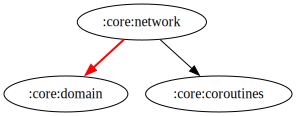

# :core:network Module

## Dependency Graph



## Overview

`:core:network` is a core module responsible for managing network interactions within the application. It provides a structured and scalable approach to handling API calls, ensuring efficiency, maintainability, and testability.

## Responsibilities

- **[API Communication](../network/src/main/kotlin/com/waffiq/bazz_movies/core/network/data/remote/retrofit/services/)** – Defines Retrofit services for seamless interaction with external APIs.
- **[Remote Data Sources](../network/src/main/kotlin/com/waffiq/bazz_movies/core/network/data/remote/datasource/)** – Encapsulates network request logic, ensuring separation of concerns.
- **[Interceptors](../network/src/main/kotlin/com/waffiq/bazz_movies/core/network/data/remote/retrofit/interceptors/ApiKeyInterceptor.kt)** – Implements request modification for authentication.
- **[Response Models](../network/src/main/kotlin/com/waffiq/bazz_movies/core/network/data/remote/responses/)** – Structures API responses into well-defined data models.
- **[Paging Integration](../network/src/main/kotlin/com/waffiq/bazz_movies/core/network/data/remote/pagingsources/)** – Supports efficient data fetching using Paging 3.
- **[Dependency Injection](../network/src/main/kotlin/com/waffiq/bazz_movies/core/network/di/)** – Provides network-related dependencies using Hilt.
- **[Error Handling](../network/src/main/kotlin/com/waffiq/bazz_movies/core/network/utils/helpers/SafeApiCallHelper.kt)** – Implements standardized approaches to handle network failures and retries.

## Integration

To use the module, add it as a dependency in `build.gradle` file:

```gradle
dependencies {
    implementation(project(":core:network"))
}
```

### Example Usage

Inject and use a network service within a repository:

```kotlin
class MovieRepository @Inject constructor(
    private val movieApiService: TMDBApiService
) {
    suspend fun getPopularMovies(): List<Movie> {
        return movieApiService.getPopularMovies().results.map { it.toDomain() }
    }
}
```

## Best Practices

- **Encapsulate API calls in data sources** – Keeps repositories focused on business logic.
- **Use DTOs and mappers** – Prevents direct exposure of network models in the domain layer.
- **Leverage interceptors** – Handles authentication, and logging efficiently.
- **Ensure proper error handling** – Use sealed classes or `NetworkResult` to standardize responses.
- **Follow dependency injection principles** – Enables better testability and modularity.

This module establishes a robust and scalable network layer, ensuring clean architecture principles are followed throughout the application.
