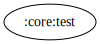

# :core:test Module

[![Code Coverage][core-test-coverage-badge]][core-test-coverage-link]

## Dependency Graph



## Overview

`:core:test` is a shared test utility module providing reusable test rules, helpers, and
configurations for unit and instrumentation tests across multiple modules.

## Responsibilities

- **Test Rules**

  - [`LifecycleOwnerRule`](../test/src/main/kotlin/com/waffiq/bazz_movies/core/test/LifecycleOwnerRule.kt) –
    Manages a `LifecycleOwner` for testing lifecycle-dependent components.
  - [`MainCoroutineRule`](../test/src/main/kotlin/com/waffiq/bazz_movies/core/test/MainCoroutineRule.kt) –
    Sets a `TestDispatcher` for coroutine-based tests.
  - [`MainDispatcherRule`](../test/src/main/kotlin/com/waffiq/bazz_movies/core/test/MainDispatcherRule.kt) –
    Configures the main dispatcher for coroutine tests.
  - [`PagingDataHelperTest`](../test/src/main/kotlin/com/waffiq/bazz_movies/core/test/PagingDataHelperTest.kt) –
    Uses as helper to test [paging data](https://developer.android.com/reference/kotlin/androidx/paging/PagingData).
    inside repository testing.  
  - - [`PagingFlowHelperTest`](../test/src/main/kotlin/com/waffiq/bazz_movies/core/test/PagingFlowHelperTest.kt) –
    Uses as helper to test [paging data](https://developer.android.com/reference/kotlin/androidx/paging/PagingData).
    inside use case testing.
  - [`UnconfinedDispatcherRule`](../test/src/main/kotlin/com/waffiq/bazz_movies/core/test/UnconfinedDispatcherRule.kt) –
    Uses an `UnconfinedTestDispatcher` for immediate coroutine execution.

## Integration

To use the module, add it as a dependency in `build.gradle` file:

```gradle
dependencies {
    testImplementation(project(":core:test"))
}
```

## Example Usage

Simply include the desired rule in test class:

```kotlin
@get:Rule
val mainDispatcherRule = MainDispatcherRule()
```

or use helpers as needed:

```kotlin
val diffCallback = PagingDataHelperTest.TestDiffCallback<MyData>()
```

<!-- LINK -->

[core-test-coverage-badge]: https://codecov.io/gh/waffiqaziz/BAZZ-Movies/branch/main/graph/badge.svg?flag=core-test
[core-test-coverage-link]: https://app.codecov.io/gh/waffiqaziz/BAZZ-Movies/tree/main/core/test/src/main/kotlin/com/waffiq/bazz_movies/core/test
