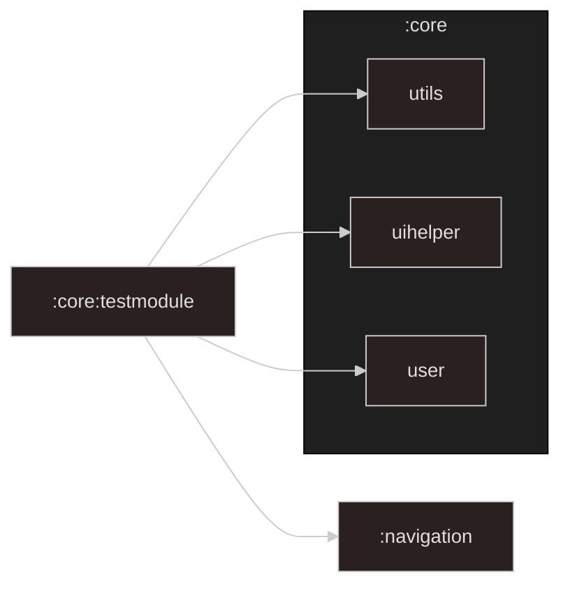

# :core:testmodule Module

[![Code Coverage][core-testmodule-coverage-badge]][core-testmodule-coverage-link]

## Dependency Graph

## Overview

`:core:testmodule` is a shared testing module that provides reusable Hilt mocks for
[feature modules](../../feature) while keeping them isolated from the real instrumentation setup in
`:app`.

<!-- LINK -->

[core-testmodule-coverage-badge]: https://codecov.io/gh/waffiqaziz/BAZZ-Movies/branch/main/graph/badge.svg?flag=core-testmodule

[core-testmodule-coverage-link]: https://app.codecov.io/gh/waffiqaziz/BAZZ-Movies/tree/main/core/testmodule/src/main/kotlin/com/waffiq/bazz_movies/core/testmodule
