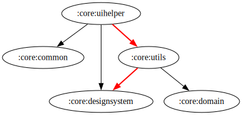

# :core:uihelper Module

[![Code Coverage][core-uihelper-coverage-badge]][core-uihelper-coverage-link]

## Dependency Graph  

  

## Overview  

`:core:uihelper` is a utility module that provides helper classes and utilities for UI interactions and animations within the application. It contains reusable components for handling UI behaviors, gestures, animations, and snackbars.

## Responsibilities  

### UI Components  

- **[ISnackbar](../uihelper/src/main/kotlin/com/waffiq/bazz_movies/core/uihelper/ISnackbar.kt)** – Interface for handling Snackbar interactions across the app.

- **[LoadingStateAdapter](../uihelper/src/main/kotlin/com/waffiq/bazz_movies/core/uihelper/ui/adapter/LoadingStateAdapter.kt)** – Adapter for handling pagination loading states in lists.

### Utility Classes  

- **[ActionBarBehavior](../uihelper/src/main/kotlin/com/waffiq/bazz_movies/core/uihelper/utils/ActionBarBehavior.kt)** – Custom behavior for managing ActionBar animations and visibility.

- **[Animation](../uihelper/src/main/kotlin/com/waffiq/bazz_movies/core/uihelper/utils/Animation.kt)** – Provides reusable animation utilities for UI components.

- **[CustomSnapHelper](../uihelper/src/main/kotlin/com/waffiq/bazz_movies/core/uihelper/utils/CustomSnapHelper.kt)** – Custom implementation of SnapHelper for RecyclerView snapping behavior.

- **[GestureHelper](../uihelper/src/main/kotlin/com/waffiq/bazz_movies/core/uihelper/utils/GestureHelper.kt)** - Utility for handling gesture interactions like swipe and drag.

- **[Helpers](../uihelper/src/main/kotlin/com/waffiq/bazz_movies/core/uihelper/utils/Helpers.kt)** – General helper functions for UI-related operations.

- **[ScrollActionBarUtils](../uihelper/src/main/kotlin/com/waffiq/bazz_movies/core/uihelper/utils/ScrollActionBarUtils.kt)** – Utility for managing scroll-based ActionBar visibility.

- **[SnackBarManager](../uihelper/src/main/kotlin/com/waffiq/bazz_movies/core/uihelper/utils/SnackBarManager.kt)** – Manages showing and dismissing Snackbars warning in a consistent way.

## Integration  

To use the module, add it as a dependency in `build.gradle` file:  

```gradle
dependencies {
    implementation(project(":core:uihelper"))
}
```

## Example Usage  

Using `SnackBarManager` to show messages:  

```kotlin
SnackBarManager.snackBarWarning(view, guideView, "This is a message")
```

## Best Practices  

- **Use `SnackBarManager` for consistent Snackbar handling** – Avoid redundant Snackbar implementations across the app.
- **Utilize `CustomSnapHelper` for smooth RecyclerView snapping** – Ensures a polished scrolling experience.
- **Leverage `Animation` utilities** – Standardize animations for UI consistency.
- **Keep UI interactions reusable** – Modular utilities help maintain cleaner and more efficient UI code.

This module improves the application's UI experience by providing structured and reusable helper classes for animations, gestures, and UI behaviors.

<!-- LINK -->

[core-uihelper-coverage-badge]: https://codecov.io/gh/waffiqaziz/BAZZ-Movies/branch/main/graph/badge.svg?flag=core-uihelper
[core-uihelper-coverage-link]: https://app.codecov.io/gh/waffiqaziz/BAZZ-Movies/tree/main/core/uihelper/src/main/kotlin/com/waffiq/bazz_movies/core/uihelper
