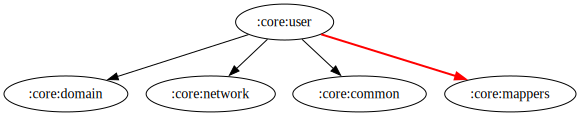

# :core:user Module

[![Code Coverage][core-user-coverage-badge]][core-user-coverage-link]

## Dependency Graph



## Overview

`:core:user` is responsible for managing user-related data, authentication, preferences, and account details. It provides a structured way to handle user sessions, authentication, and regional settings.

## Responsibilities

### Data Layer

- **[UserModelPref](../user/src/main/kotlin/com/waffiq/bazz_movies/core/user/data/model/UserModelPref.kt)** – Stores user preferences data.
- **[UserPreference](../user/src/main/kotlin/com/waffiq/bazz_movies/core/user/data/model/UserPreference.kt)** – Manages user preference settings.
- **[UserRepository](../user/src/main/kotlin/com/waffiq/bazz_movies/core/user/data/repository/UserRepository.kt)** – Implements user data handling logic.

### Dependency Injection

- **[DatastoreModule](../user/src/main/kotlin/com/waffiq/bazz_movies/core/user/di/DatastoreModule.kt)** – Provides dependencies for user preferences and authentication.
- **[UserModule](../user/src/main/kotlin/com/waffiq/bazz_movies/core/user/di/UserModule.kt)** – Dependency injection setup for user-related components.
- **[UserRepositoryModule](../user/src/main/kotlin/com/waffiq/bazz_movies/core/user/di/UserRepositoryModule.kt)** – Provides the repository dependencies.

### Domain Layer

#### Models

- **[AccountDetails](../user/src/main/kotlin/com/waffiq/bazz_movies/core/user/domain/model/account/AccountDetails.kt)** – Represents user account details.
- **[Authentication](../user/src/main/kotlin/com/waffiq/bazz_movies/core/user/domain/model/account/Authentication.kt)** – Handles authentication states.
- **[AvatarItem](../user/src/main/kotlin/com/waffiq/bazz_movies/core/user/domain/model/account/AvatarItem.kt)** – Represents user avatars.
- **[CountryIP](../user/src/main/kotlin/com/waffiq/bazz_movies/core/user/domain/model/account/CountryIP.kt)** – Manages region-based user settings.
- **[CreateSession](../user/src/main/kotlin/com/waffiq/bazz_movies/core/user/domain/model/account/CreateSession.kt)** – Represents session creation requests.

#### Repository Interface

- **[IUserRepository](../user/src/main/kotlin/com/waffiq/bazz_movies/core/user/domain/repository/IUserRepository.kt)** – Interface for user repository interactions.

#### Use Cases

- **[AuthTMDbAccountUseCase](../user/src/main/kotlin/com/waffiq/bazz_movies/core/user/domain/usecase/authtmdbaccount/AuthTMDbAccountUseCase.kt)** – Handles authentication TMDb account.
- **[GetRegionUseCase](../user/src/main/kotlin/com/waffiq/bazz_movies/core/user/domain/usecase/getregion/GetRegionUseCase.kt)** – Retrieves user region based on IP.
- **[UserPrefUseCase](../user/src/main/kotlin/com/waffiq/bazz_movies/core/user/domain/usecase/userpreference/UserPrefUseCase.kt)** – Manages user preference operations.

### UI Layer

- **[RegionViewModel](../user/src/main/kotlin/com/waffiq/bazz_movies/core/user/ui/viewmodel/RegionViewModel.kt)** – Handles region selection and management.
- **[UserPreferenceViewModel](../user/src/main/kotlin/com/waffiq/bazz_movies/core/user/ui/viewmodel/UserPreferenceViewModel.kt)** – Manages user preferences.

### Utility Classes

- **[Constants](../user/src/main/kotlin/com/waffiq/bazz_movies/core/user/utils/common/Constants.kt)** – Stores constant values used in the module.
- **[AccountMapper](../user/src/main/kotlin/com/waffiq/bazz_movies/core/user/utils/mappers/AccountMapper.kt)** – Mapper account data between different layers.

## Integration

To use the module, add it as a dependency in `build.gradle` file:

```gradle
dependencies {
    implementation(project(":core:user"))
}
```

## Example Usage

Retrieving user preferences in a ViewModel:

```kotlin
class UserPreferenceViewModel @Inject constructor(
    private val userPrefUseCase: UserPrefUseCase
) : ViewModel() {

    fun getUserPreferences(): LiveData<UserPreference> {
        return userPrefUseCase.getUserPreferences()
    }
}
```

Handling authentication:

```kotlin
viewModel.authenticateUser("sessionToken").observe(viewLifecycleOwner) { authState ->
    when (authState) {
        is Authenticated -> navigateToDashboard()
        is Unauthenticated -> showLoginError()
    }
}
```

## Best Practices

- **Use repositories for user data interactions** to keeps data logic modular and testable.
- **Leverage ViewModels** to manage UI-related data.
- **Utilize dependency injection** for managing user dependencies efficiently.
- **Encapsulate business logic in use cases** for maintainability and separation of concerns.

This module provides a scalable and structured way to handle user-related operations, ensuring a seamless authentication and preference management experience for the application.

<!-- LINK -->

[core-user-coverage-badge]: https://codecov.io/gh/waffiqaziz/BAZZ-Movies/branch/main/graph/badge.svg?flag=core-user
[core-user-coverage-link]: https://app.codecov.io/gh/waffiqaziz/BAZZ-Movies/tree/main/core/user/src/main/kotlin/com/waffiq/bazz_movies/core/user
