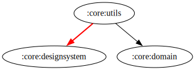

# :core:utils Module

## Dependency Graph



## Overview

`:core:utils` is a utility module that provides various helper classes and functions to streamline common operations across the application. It contains reusable components that enhance code efficiency and maintainability.

## Responsibilities

### Utility Classes

- **[DateFormatter](../utils/src/main/kotlin/com/waffiq/bazz_movies/core/utils/DateFormatter.kt)**
  - Handles date formatting and parsing operations.
  - Provides localized and standardized date conversions.

- **[FlowUtils](../utils/src/main/kotlin/com/waffiq/bazz_movies/core/utils/FlowUtils.kt)**
  - Contains extension functions for working with Kotlin Flows for PagingData.
  - Helps manage Flow state handling and transformations.

- **[GeneralHelper](../utils/src/main/kotlin/com/waffiq/bazz_movies/core/utils/GeneralHelper.kt)**
  - Provides general-purpose utility methods used across different modules.
  
- **[GenreHelper](../utils/src/main/kotlin/com/waffiq/bazz_movies/core/utils/GenreHelper.kt)**
  - Maps genre IDs to their respective genre names and vice versa.
  - Assists in displaying user-friendly genre names.

- **[GetRegionHelper](../utils/src/main/kotlin/com/waffiq/bazz_movies/core/utils/GetRegionHelper.kt)**
  - Determines user region based on locale or external sources.
  - Used to adjust content based on user location.

- **[PagingLoadStateHelper](../utils/src/main/kotlin/com/waffiq/bazz_movies/core/utils/PagingLoadStateHelper.kt)**
  - Provides helper methods for handling paging load states.
  - Improves error handling and UI consistency for paginated lists.

## Integration

To use the module, add it as a dependency in `build.gradle` file:

```gradle
dependencies {
    implementation(project(":core:utils"))
}
```

## Example Usage

Using `DateFormatter` to format dates:

```kotlin
val formattedDate = DateFormatter.dateFormatterStandard("2025-03-16T10:15:30Z")
```

Using `FlowUtils` for collecting flow safely:

```kotlin
FlowUtils.collectAndSubmitData(context, { viewModel.favoriteMovies(userToken) }, adapterPaging)
```

Using `GenreHelper` to map genre IDs:

```kotlin
val genreName = GenreHelper.getGenreName(28) // Returns "Action"
```

## Best Practices

- **Use utility functions** to avoid redundant code and maintain consistency.
- **Ensure thread safety** when working with Flow and data transformations.
- **Keep utilities modular** and avoid business logic in helper classes.

This module serves as a central place for shared utility functions, improving maintainability and code reuse across the application.
