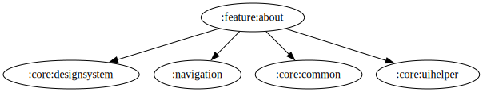

# :feature:about Module

[![Code Coverage][feature-about-coverage-badge]][feature-about-coverage-link]

## Dependency Graph



## Overview

`:feature:about` is a standalone feature module responsible for displaying information about the application. It provides a simple UI screen that presents details such as information about the app, developer information, and other relevant content.

## Structure

### UI Layer

- **[AboutActivity](../about/src/main/kotlin/com/waffiq/bazz_movies/feature/about/ui/AboutActivity.kt)**
  - A dedicated activity that serves as the entry point for the "About" section.
  - Displays application-related details in a user-friendly manner.
  
## Integration

To use this module, add it as a dependency in `build.gradle` file:

```gradle
dependencies {
    implementation(project(":feature:about"))
}
```

## Navigation

To navigate to the About screen from another part of the app, use an explicit intent:

```kotlin
val intent = Intent(context, AboutActivity::class.java)
context.startActivity(intent)
```

<!-- LINK -->

[feature-about-coverage-badge]: https://codecov.io/gh/waffiqaziz/BAZZ-Movies/branch/main/graph/badge.svg?flag=feature-about
[feature-about-coverage-link]: https://app.codecov.io/gh/waffiqaziz/BAZZ-Movies/tree/main/feature/about/src/main/kotlin/com/waffiq/bazz_movies/feature/about
