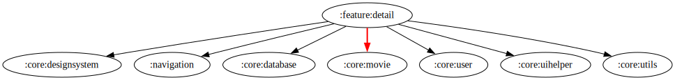

# :feature:detail Module

[![Code Coverage][feature-detail-coverage-badge]][feature-detail-coverage-link]

## Dependency Graph



## Overview

The `:feature:detail` module handles displaying detailed information about movies and TV shows. It integrates data retrieval, domain logic, and UI components to present comprehensive content.

## Structure

### Data Layer

- **Repository Implementation** – [`DetailRepositoryImpl`](../detail/src/main/kotlin/com/waffiq/bazz_movies/feature/detail/data/repository/DetailRepositoryImpl.kt) handles data fetching and processing.

### Domain Layer

- **Models** – Defines structured data objects for movies, TV shows, and additional details such as ratings and production companies.
- **Repository Interface** – [`IDetailRepository`](../detail/src/main/kotlin/com/waffiq/bazz_movies/feature/detail/domain/repository/IDetailRepository.kt) abstracts data operations.
- **Use Cases** – Includes interactor classes for fetching movie, tv-series, OMDb details, user session, and local database.

### UI Layer

- **Activities & ViewModels** – [`DetailMovieActivity`](../detail/src/main/kotlin/com/waffiq/bazz_movies/feature/detail/ui/MediaDetailActivity.kt) manages UI,
  while [`DetailMovieViewModel`](../detail/src/main/kotlin/com/waffiq/bazz_movies/feature/detail/ui/viewmodel/DetailMovieViewModel.kt)
  and [`DetailUserPrefViewModel`](../detail/src/main/kotlin/com/waffiq/bazz_movies/feature/detail/ui/viewmodel/DetailUserPrefViewModel.kt) handle state management.
- **Adapters** – [`CastAdapter`](../detail/src/main/kotlin/com/waffiq/bazz_movies/feature/detail/ui/adapter/CastAdapter.kt), [`RecommendationAdapter`](../detail/src/main/kotlin/com/waffiq/bazz_movies/feature/detail/ui/adapter/RecommendationAdapter.kt), and [`WatchProvidersAdapter`](../detail/src/main/kotlin/com/waffiq/bazz_movies/feature/detail/ui/adapter/WatchProvidersAdapter.kt) for rendering lists.
- **Managers**
  Handle UI state and interaction logic:
  - [`DetailDataManager`](../detail/src/main/kotlin/com/waffiq/bazz_movies/feature/detail/ui/manager/DetailDataManager.kt) -
  Manages the data coordination between domain use cases and UI rendering.
  - [`DetailUIManager`](../detail/src/main/kotlin/com/waffiq/bazz_movies/feature/detail/ui/manager/DetailUIManager.kt) –
    Applies visual display logic such as conditional visibility and content binding.
  - [`UserInteractionHandler`](../detail/src/main/kotlin/com/waffiq/bazz_movies/feature/detail/ui/manager/UserInteractionHandler.kt) – 
    Centralizes handling of user-driven actions like button clicks, item taps, or sharing.
  - [`WatchProvidersManager`](../detail/src/main/kotlin/com/waffiq/bazz_movies/feature/detail/ui/manager/WatchProvidersManager.kt) –
    Manages the organization and presentation logic for streaming providers.
    Handle UI state and interaction logic:
- **State**
  Handles UI state representation:
  - [`WatchProvidersUiState`](../detail/src/main/kotlin/com/waffiq/bazz_movies/feature/detail/ui/state/WatchProvidersUiState.kt), -
    Represents the UI state of the watch provider section, including loading, success (`flatrate`, `rent`, `buy`, and `free`), and error cases.
  - [`UserAuthState`](../detail/src/main/kotlin/com/waffiq/bazz_movies/feature/detail/ui/state/UserAuthState.kt), -
    Represents the authentication state of the user, including not initialized, guest, and logged in.'

### Utilities

- **Helpers** – Functions for handling ratings, release dates, and UI components.
- **Mappers** – Convert raw data into structured domain models.

## Integration

To use this module, add it as a dependency:

```gradle
dependencies {
    implementation(project(":feature:detail"))
}
```

## Navigation

To open the detail screen:

```kotlin
val intent = Intent(context, DetailMovieActivity::class.java)
context.startActivity(intent)
```

<!-- LINK -->

[feature-detail-coverage-badge]: https://codecov.io/gh/waffiqaziz/BAZZ-Movies/branch/main/graph/badge.svg?flag=feature-detail
[feature-detail-coverage-link]: https://app.codecov.io/gh/waffiqaziz/BAZZ-Movies/tree/main/feature/detail/src/main/kotlin/com/waffiq/bazz_movies/feature/detail
