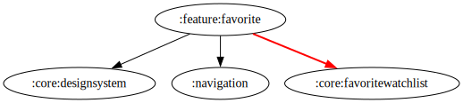

# :feature:favorite Module

## Dependency Graph



## Overview

`:feature:favorite` module handles the functionality for managing users' favorite movies and TV shows. It provides UI components and business logic to retrieve, display, and manage the user's saved favorites.

## Structure

### Data Layer

- **[FavoriteRepositoryImpl](../favorite/src/main/kotlin/com/waffiq/bazz_movies/feature/favorite/data/repository/FavoriteRepositoryImpl.kt)** – Implements the repository interface to fetch and store favorite item.

### Dependency Injection

- **[FavoriteRepositoryModule](../favorite/src/main/kotlin/com/waffiq/bazz_movies/feature/favorite/di/FavoriteRepositoryModule.kt)** – Provides the repository implementation.
- **[FavoriteUseCaseModule](../favorite/src/main/kotlin/com/waffiq/bazz_movies/feature/favorite/di/FavoriteUseCaseModule.kt)** – Binds the use cases for fetching favorite movies and TV shows.

### Domain Layer

- **[IFavoriteRepository](../favorite/src/main/kotlin/com/waffiq/bazz_movies/feature/favorite/domain/repository/IFavoriteRepository.kt)** – Defines the contract for favorite operations.
- **Use Cases**
  - [`GetFavoriteMovieInteractor`](../favorite/src/main/kotlin/com/waffiq/bazz_movies/feature/favorite/domain/usecase/GetFavoriteMovieInteractor.kt), [`GetFavoriteMovieUseCase`](../favorite/src/main/kotlin/com/waffiq/bazz_movies/feature/favorite/domain/usecase/GetFavoriteMovieUseCase.kt) – Handle movie favorites.
  - [`GetFavoriteTvInteractor`](../favorite/src/main/kotlin/com/waffiq/bazz_movies/feature/favorite/domain/usecase/GetFavoriteTvInteractor.kt), [`GetFavoriteTvUseCase`](../favorite/src/main/kotlin/com/waffiq/bazz_movies/feature/favorite/domain/usecase/GetFavoriteTvUseCase.kt) – Handle TV show favorites.

### UI Layer

- **Fragments**
  - [`MyFavoriteFragment`](../favorite/src/main/kotlin/com/waffiq/bazz_movies/feature/favorite/ui/MyFavoriteFragment.kt) – Main entry for the favorites section.
  - [`MyFavoriteMoviesFragment`](../favorite/src/main/kotlin/com/waffiq/bazz_movies/feature/favorite/ui/MyFavoriteMoviesFragment.kt) – Displays favorite movies.
  - [`MyFavoriteTvSeriesFragment`](../favorite/src/main/kotlin/com/waffiq/bazz_movies/feature/favorite/ui/MyFavoriteTvSeriesFragment.kt) – Displays favorite TV series.
- **ViewModel**
  - [`MyFavoriteViewModel`](../favorite/src/main/kotlin/com/waffiq/bazz_movies/feature/favorite/ui/MyFavoriteViewModel.kt) – Manages favorite data and UI state.

## Integration

To use this module, add it as a dependency:

```gradle
dependencies {
    implementation(project(":feature:favorite"))
}
```
