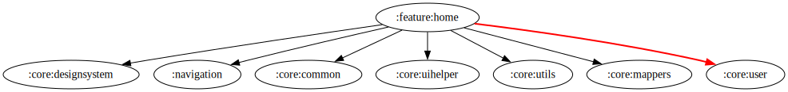

# :feature:home Module

## Dependency Graph



## Overview

`:feature:home` is responsible for displaying the main home screen of the application. It features different sections such as trending movies, TV series, and featured content. This module follows a clean architecture approach, ensuring modularity, maintainability, and testability.

## Structure

### Data Layer

- **[HomeRepositoryImpl](../home/src/main/kotlin/com/waffiq/bazz_movies/feature/home/data/repository/HomeRepositoryImpl.kt)** – Implements [`IHomeRepository`](../home/src/main/kotlin/com/waffiq/bazz_movies/feature/home/domain/repository/IHomeRepository.kt), handling data fetching and caching mechanisms.

### Dependency Injection

- **[HomeRepositoryModule](../home/src/main/kotlin/com/waffiq/bazz_movies/feature/home/di/HomeRepositoryModule.kt)** – Provides dependencies for repository implementations.
- **[HomeUseCaseModule](../home/src/main/kotlin/com/waffiq/bazz_movies/feature/home/di/HomeUseCaseModule.kt)** – Supplies use case dependencies to interact with the domain layer.

### Domain Layer

- **Repository Interface**
  - **[IHomeRepository](../home/src/main/kotlin/com/waffiq/bazz_movies/feature/home/domain/repository/IHomeRepository.kt)** – Defines the contract for data operations related to movies and TV shows.
- **Use Cases** – Encapsulate business logic for fetching and processing home screen data.
  - **[GetListMoviesUseCase](../home/src/main/kotlin/com/waffiq/bazz_movies/feature/home/domain/usecase/getListMovie/GetListMoviesUseCase.kt)** – Retrieves a list of movies.
  - **[GetListTvUseCase](../home/src/main/kotlin/com/waffiq/bazz_movies/feature/home/domain/usecase/getListTv/GetListTvUseCase.kt)** – Retrieves a list of TV shows.

### UI Layer

- **Fragments** – Manage the different sections of the home screen.
  - **[HomeFragment](../home/src/main/kotlin/com/waffiq/bazz_movies/feature/home/ui/HomeFragment.kt)** – Serves as the main entry point for the home screen.
  - **[FeaturedFragment](../home/src/main/kotlin/com/waffiq/bazz_movies/feature/home/ui/FeaturedFragment.kt)** – Displays featured content.
  - **[MovieFragment](../home/src/main/kotlin/com/waffiq/bazz_movies/feature/home/ui/MovieFragment.kt)** – Displays the list of movies.
  - **[TvSeriesFragment](../home/src/main/kotlin/com/waffiq/bazz_movies/feature/home/ui/TvSeriesFragment.kt)** – Displays the list of TV series.
- **Adapters** – Handle UI lists and item rendering for smooth scrolling.
  - [`ItemWideAdapter`](../home/src/main/kotlin/com/waffiq/bazz_movies/feature/home/ui/adapter/ItemWIdeAdapter.kt), [`MovieHomeAdapter`](../home/src/main/kotlin/com/waffiq/bazz_movies/feature/home/ui/adapter/MovieHomeAdapter.kt), [`TrendingAdapter`](../home/src/main/kotlin/com/waffiq/bazz_movies/feature/home/ui/adapter/TrendingAdapter.kt), [`TvAdapter`](../home/src/main/kotlin/com/waffiq/bazz_movies/feature/home/ui/adapter/TvAdapter.kt)
- **Shimmer Loading** – Provides skeleton loading UI while data is being fetched.
  - [`ShimmerAdapter`](../home/src/main/kotlin/com/waffiq/bazz_movies/feature/home/ui/shimmer/ShimmerAdapter.kt), [`ShimmerItemWideAdapter`](../home/src/main/kotlin/com/waffiq/bazz_movies/feature/home/ui/shimmer/ShimmerItemWideAdapter.kt)
- **ViewModels** – Manage UI-related data and state handling.
  - **[MovieViewModel](../home/src/main/kotlin/com/waffiq/bazz_movies/feature/home/ui/viewmodel/MovieViewModel.kt)** – Handles movie-related UI logic.
  - **[TvSeriesViewModel](../home/src/main/kotlin/com/waffiq/bazz_movies/feature/home/ui/viewmodel/TvSeriesViewModel.kt)** – Handles TV series-related UI logic.

### Utilities

- **Common Helpers** – Contain constants and shared functions.
  - [`Constants.kt`](../home/src/main/kotlin/com/waffiq/bazz_movies/feature/home/utils/common/Constants.kt)
- **UI Helpers** – Provide helper functions to improve UI interactions.
  - [`FlowJobHelper.kt`](../home/src/main/kotlin/com/waffiq/bazz_movies/feature/home/utils/helpers/FlowJobHelper.kt) – Manages coroutine jobs for UI.
  - [`Helper.kt`](../home/src/main/kotlin/com/waffiq/bazz_movies/feature/home/utils/helpers/Helper.kt) – Contains utility functions for common operations.
  - [`HomeFragmentHelper.kt`](../home/src/main/kotlin/com/waffiq/bazz_movies/feature/home/utils/helpers/HomeFragmentHelper.kt) – Assists in UI logic for the home screen.

## Integration

To use this module, add it as a dependency in the `build.gradle` file:

```gradle
dependencies {
    implementation(project(":feature:home"))
}
```
