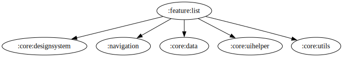

# :feature:list Module

[![Code Coverage][feature-list-coverage-badge]][feature-list-coverage-link]

## Dependency Graph

## Overview

`:feature:list` is responsible for handling to show list of movie and tv-series based on genre.

## Testing

In this module, we use JUnit4 for standard unit and instrumentation testing but also Kotest for more expressive behavior-driven for unit tests.

<!-- LINK -->

[feature-list-coverage-badge]: https://codecov.io/gh/waffiqaziz/BAZZ-Movies/branch/main/graph/badge.svg?flag=feature-list
[feature-list-coverage-link]: https://app.codecov.io/gh/waffiqaziz/BAZZ-Movies/tree/main/feature/list/src/main/kotlin/com/waffiq/bazz_movies/feature/list
