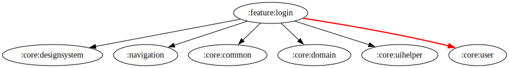

# :feature:login Module

[![Code Coverage][feature-login-coverage-badge]][feature-login-coverage-link]

## Dependency Graph



## Overview

`:feature:login` module is responsible for handling user authentication within the application. It provides the necessary UI components and business logic to facilitate login functionality.

## Structure

### Dependency Injection

- **[AuthTMDbAccountUseCaseModule](../login/src/main/kotlin/com/waffiq/bazz_movies/feature/login/di/AuthTMDbAccountUseCaseModule.kt)**: Provides dependencies related to TMDb authentication use cases.

### UI Layer

- **[LoginActivity](../login/src/main/kotlin/com/waffiq/bazz_movies/feature/login/ui/LoginActivity.kt)**: The main login screen where users enter credentials.
- **[AuthenticationViewModel](../login/src/main/kotlin/com/waffiq/bazz_movies/feature/login/ui/AuthenticationViewModel.kt)**: Manages authentication logic and communicates with the domain layer.

### Utils

- **[CustomTypefaceSpan](../login/src/main/kotlin/com/waffiq/bazz_movies/feature/login/utils/CustomTypefaceSpan.kt)**: Utility class for customizing text appearance.
- **[Constants](../login/src/main/kotlin/com/waffiq/bazz_movies/feature/login/utils/common/Constants.kt)**: Common constants used in the login feature.

## Integration

To use this module, add it as a dependency in `build.gradle` file:

```gradle
dependencies {
    implementation(project(":feature:login"))
}
```

## Navigation

To navigate to the login screen from another part of the app:

```kotlin
val intent = Intent(context, LoginActivity::class.java)
context.startActivity(intent)
```

<!-- LINK -->

[feature-login-coverage-badge]: https://codecov.io/gh/waffiqaziz/BAZZ-Movies/branch/main/graph/badge.svg?flag=feature-login
[feature-login-coverage-link]: https://app.codecov.io/gh/waffiqaziz/BAZZ-Movies/tree/main/feature/login/src/main/kotlin/com/waffiq/bazz_movies/feature/login
