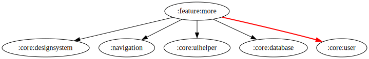

# :feature:more Module

[![Code Coverage][feature-more-coverage-badge]][feature-more-coverage-link]

## Dependency Graph



## Overview

`:feature:more` is responsible for displaying additional options and settings within the application. It provides a user interface where users can access various app-related features beyond the core functionalities.

## Structure

### UI Layer

- **[MoreFragment](../more/src/main/kotlin/com/waffiq/bazz_movies/feature/more/ui/MoreFragment.kt)**
  - Serves as the main entry point for the "More" section.
  - Provides navigation to additional settings or options.

- **[MoreLocalViewModel](../more/src/main/kotlin/com/waffiq/bazz_movies/feature/more/ui/MoreLocalViewModel.kt)**
  - Manages locally stored settings and preferences for the "More" section.

- **[MoreUserViewModel](../more/src/main/kotlin/com/waffiq/bazz_movies/feature/more/ui/MoreUserViewModel.kt)**
  - Handles user-related data and interactions.

## Integration

To use this module, add it as a dependency in `build.gradle` file:

```gradle
dependencies {
    implementation(project(":feature:more"))
}
```

## Navigation

To navigate to the "More" section, use the following approach:

```kotlin
val fragment = MoreFragment()
fragmentManager.beginTransaction()
    .replace(R.id.container, fragment)
    .addToBackStack(null)
    .commit()
```

<!-- LINK -->

[feature-more-coverage-badge]: https://codecov.io/gh/waffiqaziz/BAZZ-Movies/branch/main/graph/badge.svg?flag=feature-more
[feature-more-coverage-link]: https://app.codecov.io/gh/waffiqaziz/BAZZ-Movies/tree/main/feature/more/src/main/kotlin/com/waffiq/bazz_movies/feature/more
