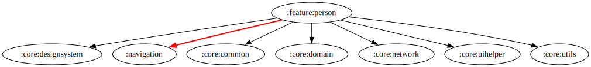

# :feature:person Module

[![Code Coverage][feature-person-coverage-badge]][feature-person-coverage-link]

## Dependency Graph



## Overview

`:feature:person` module handles the functionality related to retrieving and displaying detailed information about actor or actresss, including their credits, images, and social media.

## Structure

### Data Layer

- **[PersonRepositoryImpl](../person/src/main/kotlin/com/waffiq/bazz_movies/feature/person/data/repository/PersonRepositoryImpl.kt)** – Implements [`IPersonRepository`](./src/main/kotlin/com/waffiq/bazz_movies/feature/person/domain/repository/IPersonRepository.kt) to fetch person-related data from the API.

### Dependency Injection (DI)

- **[PersonRepositoryModule](../person/src/main/kotlin/com/waffiq/bazz_movies/feature/person/di/PersonRepositoryModule.kt)** – Provides the repository instance.
- **[PersonUseCaseModule](../person/src/main/kotlin/com/waffiq/bazz_movies/feature/person/di/PersonUseCaseModule.kt)** – Provides use case instances for retrieving person details.

### Domain Layer

#### Models

- **[DetailPerson](../person/src/main/kotlin/com/waffiq/bazz_movies/feature/person/domain/model/DetailPerson.kt)** – Represents detailed person information.
- **[CombinedCreditPerson](../person/src/main/kotlin/com/waffiq/bazz_movies/feature/person/domain/model/CombinedCreditPerson.kt)** – Stores credits for movies and TV shows.

#### Repository

- **[IPersonRepository](../person/src/main/kotlin/com/waffiq/bazz_movies/feature/person/domain/repository/IPersonRepository.kt)** – Defines the contract for fetching person-related data.

#### Use Cases

- **[GetDetailPersonUseCase](../person/src/main/kotlin/com/waffiq/bazz_movies/feature/person/domain/usecase/GetDetailPersonUseCase.kt)** – Defines the use case for retrieving person details.
- **[GetDetailPersonInteractor](../person/src/main/kotlin/com/waffiq/bazz_movies/feature/person/domain/usecase/GetDetailPersonInteractor.kt)** – Implements the use case logic.

### UI Layer

- **[PersonActivity](../person/src/main/kotlin/com/waffiq/bazz_movies/feature/person/ui/PersonActivity.kt)** – Displays person details with their images and credits.
- **[PersonViewModel](../person/src/main/kotlin/com/waffiq/bazz_movies/feature/person/ui/PersonViewModel.kt)** – Manages UI logic and interacts with the domain layer.

#### Adapters

- **[ImagePagerAdapter](../person/src/main/kotlin/com/waffiq/bazz_movies/feature/person/ui/adapter/ImagePagerAdapter.kt)** – Handles image carousel display.
- **[KnownForAdapter](../person/src/main/kotlin/com/waffiq/bazz_movies/feature/person/ui/adapter/KnownForAdapter.kt)** – Displays the person's known movies/TV shows.

### Utilities

- **[PersonMapper](../person/src/main/kotlin/com/waffiq/bazz_movies/feature/person/utils/mapper/PersonMapper.kt)** – Maps API responses to domain models.
- **[PersonPageHelper](../person/src/main/kotlin/com/waffiq/bazz_movies/feature/person/utils/helper/PersonPageHelper.kt)** – Provides helper functions for person-related UI logic.

## Integration

To use this module, add the dependency in `build.gradle`:

```gradle
dependencies {
    implementation(project(":feature:person"))
}
```

## Navigation

To navigate to the Person details screen:

```kotlin
val intent = Intent(context, PersonActivity::class.java)
intent.putExtra("personId", personId)
context.startActivity(intent)
```

<!-- LINK -->

[feature-person-coverage-badge]: https://codecov.io/gh/waffiqaziz/BAZZ-Movies/branch/main/graph/badge.svg?flag=feature-person
[feature-person-coverage-link]: https://app.codecov.io/gh/waffiqaziz/BAZZ-Movies/tree/main/feature/person/src/main/kotlin/com/waffiq/bazz_movies/feature/person
