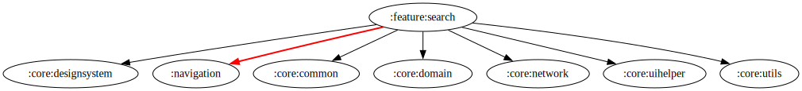

# :feature:search Module

[![Code Coverage][feature-search-coverage-badge]][feature-search-coverage-link]

## Dependency Graph



## Overview

`:feature:search` is responsible for handling search functionality within the application. It allows users to search for movies, TV shows, and actors/actresses using multi-search feature. This module follows a clean architecture approach to maintain separation of concerns and modularity.

## Structure

### Data Layer

- **[SearchRepositoryImpl](../search/src/main/kotlin/com/waffiq/bazz_movies/feature/search/data/repository/SearchRepositoryImpl.kt)** – Implements [`ISearchRepository`](./src/main/kotlin/com/waffiq/bazz_movies/feature/search/domain/repository/ISearchRepository.kt) to fetch and process search results.

### Dependency Injection

- **[SearchRepositoryModule](../search/src/main/kotlin/com/waffiq/bazz_movies/feature/search/di/SearchRepositoryModule.kt)** – Provides dependencies for repository implementations.
- **[SearchUseCaseModule](../search/src/main/kotlin/com/waffiq/bazz_movies/feature/search/di/SearchUseCaseModule.kt)** – Supplies use cases for interacting with the domain layer.

### Domain Layer

- **Repository Interface**
  - **[ISearchRepository](../search/src/main/kotlin/com/waffiq/bazz_movies/feature/search/domain/repository/ISearchRepository.kt)** – Defines the contract for fetching search results.
- **Use Cases**
  - **[MultiSearchUseCase](../search/src/main/kotlin/com/waffiq/bazz_movies/feature/search/domain/usecase/MultiSearchUseCase.kt)** – Retrieves combined search results for movies, TV shows, and people.

### UI Layer

- **Fragments**
  - **[SearchFragment](../search/src/main/kotlin/com/waffiq/bazz_movies/feature/search/ui/SearchFragment.kt)** – Displays search input and results.
- **Adapters**
  - [`SearchAdapter`](./src/main/kotlin/com/waffiq/bazz_movies/feature/search/ui/SearchAdapter.kt) – Handles the display of search results.
  - [`ShimmerAdapter`](./src/main/kotlin/com/waffiq/bazz_movies/feature/search/ui/ShimmerAdapter.kt) – Provides skeleton UI for loading states.
- **ViewModels**
  - **[SearchViewModel](../search/src/main/kotlin/com/waffiq/bazz_movies/feature/search/ui/SearchViewModel.kt)** – Manages search queries and results.

### Utilities

- **Common Helpers**
  - [`Constants.kt`](./src/main/kotlin/com/waffiq/bazz_movies/feature/search/utils/Constants.kt) – Stores constant values for search functionality.
- **UI Helpers**
  - [`SearchHelper.kt`](./src/main/kotlin/com/waffiq/bazz_movies/feature/search/utils/SearchHelper.kt) – Provides utility functions for processing search data.
  - [`SearchMapper.kt`](./src/main/kotlin/com/waffiq/bazz_movies/feature/search/utils/SearchMapper.kt) – Maps API responses to UI models.

## Integration

To use this module, add it as a dependency in the `build.gradle` file:

```gradle
dependencies {
    implementation(project(":feature:search"))
}
```

<!-- LINK -->

[feature-search-coverage-badge]: https://codecov.io/gh/waffiqaziz/BAZZ-Movies/branch/main/graph/badge.svg?flag=feature-search
[feature-search-coverage-link]: https://app.codecov.io/gh/waffiqaziz/BAZZ-Movies/tree/main/feature/search/src/main/kotlin/com/waffiq/bazz_movies/feature/search
