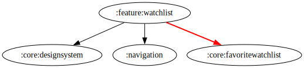

# :feature:watchlist Module

## Dependency Graph



## Overview

`:feature:watchlist` is responsible for managing users' watchlists. It allows users to save and view their favorite movies and TV series for later viewing. This module follows a clean architecture approach to maintain separation of concerns and ensure modularity.

## Structure

### Data Layer

The data layer is responsible for handling watchlist-related data.

- **[WatchlistRepositoryImpl](../watchlist/src/main/kotlin/com/waffiq/bazz_movies/feature/watchlist/data/repository/WatchlistRepositoryImpl.kt)** – Implements [`IWatchlistRepository`]((../watchlist/src/main/kotlin/com/waffiq/bazz_movies/feature/watchlist/domain/repository/IWatchlistRepository.kt)) to manage adding, removing, and retrieving watchlist items.

### Dependency Injection

- **[WatchlistRepositoryModule](../watchlist/src/main/kotlin/com/waffiq/bazz_movies/feature/watchlist/di/WatchlistRepositoryModule.kt)** – Provides dependencies for repository implementations.
- **[WatchlistUseCaseModule](../watchlist/src/main/kotlin/com/waffiq/bazz_movies/feature/watchlist/di/WatchlistUseCaseModule.kt)** – Supplies use cases for interacting with the domain layer.

### Domain Layer

- **Repository Interface**
  - **[IWatchlistRepository](../watchlist/src/main/kotlin/com/waffiq/bazz_movies/feature/watchlist/domain/repository/IWatchlistRepository.kt)** – Defines the contract for managing the watchlist.
- **Use Cases**
  - **[GetWatchlistMovieUseCase](../watchlist/src/main/kotlin/com/waffiq/bazz_movies/feature/watchlist/domain/usecase/GetWatchlistMovieUseCase.kt)** – Retrieves movies saved in the watchlist.
  - **[GetWatchlistTvUseCase](../watchlist/src/main/kotlin/com/waffiq/bazz_movies/feature/watchlist/domain/usecase/GetWatchlistTvUseCase.kt)** – Retrieves TV series saved in the watchlist.

### UI Layer

- **Fragments**
  - **[MyWatchlistFragment](../watchlist/src/main/kotlin/com/waffiq/bazz_movies/feature/watchlist/ui/MyWatchlistFragment.kt)** – Displays the user's watchlist.
  - **[MyWatchlistMoviesFragment](../watchlist/src/main/kotlin/com/waffiq/bazz_movies/feature/watchlist/ui/MyWatchlistMoviesFragment.kt)** – Shows only movies in the watchlist.
  - **[MyWatchlistTvSeriesFragment](../watchlist/src/main/kotlin/com/waffiq/bazz_movies/feature/watchlist/ui/MyWatchlistTvSeriesFragment.kt)** – Shows only TV series in the watchlist.
- **ViewModel**
  - **[MyWatchlistViewModel](../watchlist/src/main/kotlin/com/waffiq/bazz_movies/feature/watchlist/ui/MyWatchlistViewModel.kt)** – Manages watchlist data and interactions.

## Integration

To use this module, add it as a dependency in the `build.gradle` file:

```gradle
dependencies {
    implementation(project(":feature:watchlist"))
}
```
