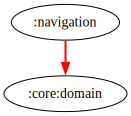

# :navigation Module  

## Dependency Graph  



## Overview  

`:navigation` is a core module responsible for handling app navigation in a structured and centralized manner. It abstracts navigation logic, ensuring modularity, maintainability, and consistency across different app components.  

## Responsibilities  

- **Navigation Interface** ([`INavigator`](../navigation/src/main/kotlin/com/waffiq/bazz_movies/navigation/INavigator.kt))  
  - Defines a contract for navigation between activities and screens.  
  - Provides an abstraction layer, enabling easy replacement or modification of navigation implementations.  

### Navigation Methods  

- `openPersonDetails(context: Context, cast: MediaCastItem)` – Opens the details screen for a specific cast member.  
- `openDetails(context: Context, mediaItem: MediaItem)` – Navigates to a detailed view of a selected movie or TV show.  
- `openMainActivity(context: Context)` – Launches the main activity of the application.  
- `openLoginActivity(context: Context)` – Redirects users to the login screen.  
- `openAboutActivity(context: Context)` – Opens the About section of the app.  
- `snackbarAnchor(): Int` – Provides a UI anchor for displaying snackbars.  

## Integration  

To use the module, add it as a dependency in `build.gradle` file:  

```gradle
dependencies {
    implementation(project(":navigation"))
}
```  

## Example Usage  

To navigate to the details screen, inject the `INavigator` implementation and call the appropriate method:  

```kotlin
class MovieAdapter(private val navigator: INavigator) {
    fun onMovieClicked(context: Context, movie: MediaItem) {
        navigator.openDetails(context, movie)
    }
}
```

## Best Practices  

- **Use Dependency Injection** – Inject `INavigator` where needed to keep navigation logic centralized.  
- **Keep Navigation Decoupled** – Avoid hardcoding navigation logic within activities or fragments.  
- **Maintain Consistency** – Ensure all navigation calls go through the `INavigator` interface for modularity.  

This module ensures a clean and structured approach to navigation, promoting better separation of concerns within the app.
